<div align="center">


# Análisis, Arquitectura y Base de Datos MediConnect (Proyecto Productivo)

<br><br>

**APRENDIZ:** PEDRO PABLO CONTRERAS VEGA

<br>

**INSTRUCTOR DE SEGUIMIENTO**:  
CLAUDIA MILENA VERA CASTELLANOS

**INSTRUCTOR TÉCNICO**:  
EDGAR CARVAJAL CACERES

<br>

**Servicio Nacional de Aprendizaje (SENA)** PROGRAMACION DE SOFTWARE (Ficha: 3186277)  
TECNICO

**2026**

</div>

<div style="page-break-after: always;"></div>

## Introducción y Resumen Ejecutivo

**MediConnect** es un sistema de gestión clínica (MVP) diseñado bajo una arquitectura de inquilino único (*Single-Tenant*) para digitalizar y automatizar los flujos operativos de una clínica médica. El objetivo de este sistema es resolver la ineficiencia en la asignación de turnos, asegurar la integridad de las historias clínicas y establecer un canal de comunicación proactivo con los pacientes.

El alcance de este proyecto se delimita estrictamente a cuatro pilares transaccionales:
1. **Control de Acceso Basado en Roles (RBAC):** Aislamiento de vistas y permisos para Administradores, Médicos y Recepcionistas.
2. **Motor de Agendamiento:** Sistema de reserva con prevención algorítmica de solapamientos horarios y bloqueos de concurrencia.
3. **Gestión Clínica Inmutable:** Registro de signos vitales, diagnósticos y notas médicas con garantías de inmutabilidad tras su finalización.
4. **Automatización Asíncrona:** Disparo de notificaciones de confirmación vía WhatsApp integrando webhooks y flujos de trabajo locales.

A nivel de arquitectura de software, la solución adopta un modelo cliente-servidor estricto, separando la capa de presentación, la API RESTful de lógica de negocio y el motor de automatización, garantizando aislamiento físico de los datos y escalabilidad futura.

---


El siguiente bloque contiene las Historias de Usuario priorizadas para el MVP. Cada historia describe el rol, la necesidad y los criterios de aceptación que guiarán el desarrollo, las pruebas y la priorización de entregas. Las HU están organizadas por épicas funcionales para facilitar la trazabilidad entre requisitos, tareas y casos de prueba.

**Historias de Usuario**

**ÉPICA 1: Autenticación y Control de Acceso (RBAC)**

**HU-01: Autenticación de Usuarios (Login)**

- **Como** Usuario del sistema (Administrador, Médico o Recepcionista).
- **Quiero** iniciar sesión utilizando mis credenciales.
- **Para** acceder a las funciones del sistema según mi nivel de permisos.
- **Criterios de Aceptación:**
  - El sistema debe validar el usuario y contraseña contra la base de datos.
  - Las contraseñas deben estar encriptadas utilizando el algoritmo Argon2.
  - Una autenticación exitosa debe generar y retornar un token JWT (JSON Web Token) sin estado.
  - El frontend debe redirigir al dashboard correspondiente según el rol extraído del JWT (RF-01).

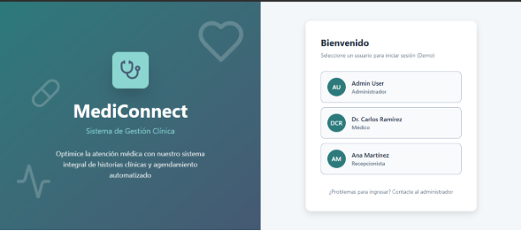

**HU-02: Renderizado Dinámico de Interfaces**

- **Como** Usuario autenticado.
- **Quiero** ver únicamente las opciones de navegación correspondientes a mi rol.
- **Para** no tener acceso a vistas no autorizadas.
- **Criterios de Aceptación:**
  - Si el rol es MÉDICO, el sidebar debe ocultar "Gestión de Usuarios" y mostrar "Mis Pacientes" y "Mi Agenda".
  - Cualquier intento de forzar una URL no autorizada en el frontend debe redirigir a una pantalla de error 403.
  - El backend debe rechazar peticiones a endpoints restringidos mediante la configuración del SecurityFilterChain.

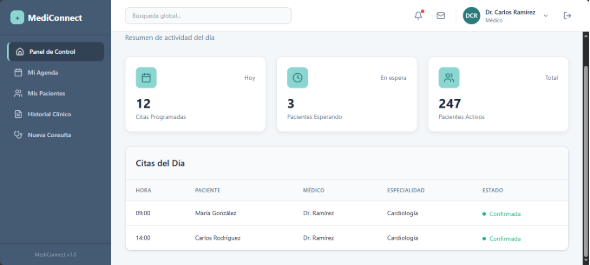

**ÉPICA 2: Admisión y Aprovisionamiento**

**HU-03: Registro de Paciente y Aprovisionamiento de Expediente**

- **Como** Recepcionista.
- **Quiero** registrar a un paciente nuevo en el sistema.
- **Para** poder agendarle citas posteriormente.
- **Criterios de Aceptación:**
  - El formulario debe requerir obligatoriamente Documento, Nombre Completo, Teléfono y Fecha de Nacimiento.
  - **Transaccionalidad Crítica:** Al guardar al paciente en la tabla patients, el backend debe generar automáticamente (en la misma transacción) un registro vacío en la tabla medical\_records vinculado a este paciente.
  - Si falla la creación de la Historia Clínica, debe hacerse un *rollback* y no debe guardarse al paciente.
  - El documento de identidad debe ser único (UNIQUE constraint). El sistema debe lanzar un error 409 si se intenta duplicar.

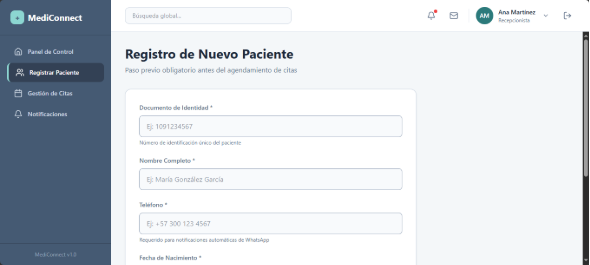


**ÉPICA 3: Gestión de Agenda Médica**

**Historia de Usuario 04 (HU-04): Motor de Agendamiento Concurrente**

- **Como Recepcionista.**
- **Quiero** agendar una cita médica asignando un paciente, un médico y una fecha/hora específica.
- **Para** reservar el espacio en la agenda clínica sin riesgo de colisiones horarias.
- Criterios de Aceptación:
  - El sistema debe validar la existencia de una Historia Clínica (MedicalRecord) asociada al paciente. Si no existe, la transacción debe ser rechazada.
  - El sistema debe asumir bloques de consulta de exactamente 30 minutos.
  - Control de Concurrencia: Si dos usuarios intentan agendar al mismo médico en intervalos que se solapen, el sistema debe bloquear el registro del médico a nivel de base de datos (PESSIMISTIC\_WRITE) y rechazar la segunda petición con un error HTTP 409 (Conflict).
  - La cita debe crearse con estado SCHEDULED y todos los campos clínicos (signos vitales, notas) deben inicializarse como nulos.

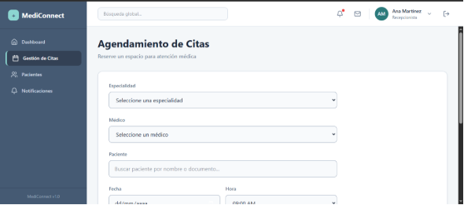

**Historia de Usuario 05 (HU-05): Automatización de Notificaciones Asíncronas**

- **Como** Sistema (Backend).
- **Quiero** emitir una alerta de notificación inmediatamente después de confirmar una cita.
- **Para** que el servicio de integración (n8n) envíe la confirmación por WhatsApp al paciente sin congelar la interfaz de la recepcionista.
- Criterios de Aceptación:
  - El evento de notificación solo debe dispararse después de que la base de datos confirme el guardado de la cita (After Commit).
  - El sistema debe registrar la notificación en la base de datos con estado PENDING antes de hacer la petición HTTP.
  - El payload enviado al webhook debe contener el ID de la notificación, nombre del paciente, número de destino, nombre del médico y fecha en formato ISO 8601.
  - Si el servidor de n8n no responde, el sistema debe capturar el error y cambiar el estado en la base de datos a FAILED sin detener la ejecución de la aplicación.

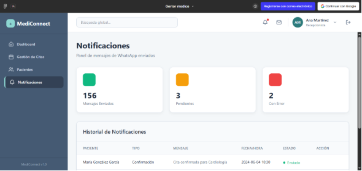

**ÉPICA 4: Ejecución Clínica (Modelo Híbrido)**

**HU-06: Registro de Atención Médica**

- **Como** Médico.
- **Quiero** registrar los datos clínicos de un paciente durante su cita.
- **Para** mantener la trazabilidad de su historia clínica.
- **Criterios de Aceptación:**
  - El médico solo puede registrar datos en una cita cuyo estado sea SCHEDULED.
  - Al guardar, el estado de la cita debe cambiar a COMPLETED.
  - **Validación Estructural:** Los campos de signos vitales deben respetar las restricciones de la base de datos (ej. Presión sistólica entre 0 y 300).
  - El sistema debe permitir actualizar únicamente los campos clínicos de la entidad consultations (peso, presión, CIE-10, notas), manteniendo inmutables la fecha original y el médico asignado.

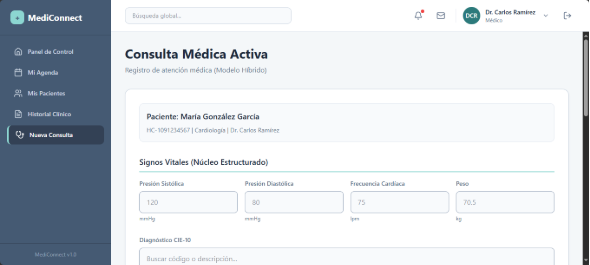

**HU-07: Visualización de Línea de Tiempo Clínica**

- **Como** Médico.
- **Quiero** consultar el historial de atenciones previas de un paciente.
- **Para** tomar decisiones médicas informadas.
- **Criterios de Aceptación:**
  - La interfaz debe cargar todas las citas en estado COMPLETED asociadas al medical\_record\_id del paciente.
  - La información debe presentarse en orden cronológico descendente (las más recientes primero).
  - Estas consultas pasadas deben ser estrictamente de solo lectura (inmutabilidad de datos).

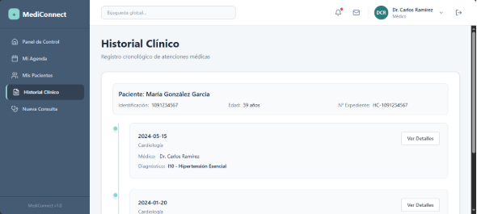

**ÉPICA 5: Administración Global del Sistema**

**HU-08: Gestión Integral de Personal (Pantalla: Gestión de Usuarios)**

- **Como** Administrador.
- **Quiero** administrar el acceso y los datos del personal de la clínica (médicos y recepcionistas).
- **Para** mantener el control operativo y la seguridad del sistema.
- **Criterios de Aceptación:**
  - El sistema debe listar a todos los usuarios mostrando su rol y especialidad (si aplica).
  - Al crear un usuario con el rol MÉDICO, el backend debe insertar los datos en la tabla users y simultáneamente crear su perfil en la tabla doctors (relación 1:1).
  - **Soft Delete:** El interruptor (toggle) de "Activo/Inactivo" no debe borrar el registro de la base de datos, sino cambiar el campo booleano is\_active a false. Un usuario inactivo debe recibir un error 401 si intenta iniciar sesión.

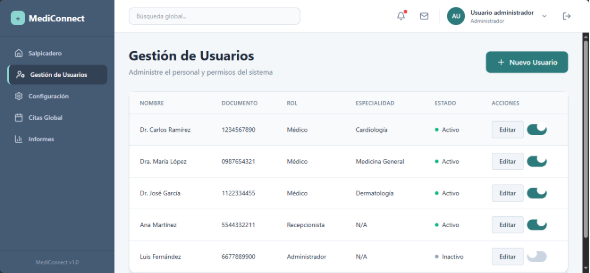

**HU-09: Panel de Reportes Clínicos (Pantalla: Reportes)**

- **Como** Administrador.
- **Quiero** visualizar estadísticas consolidadas sobre la operación de la clínica.
- **Para** analizar el volumen de atención y la prevalencia de diagnósticos.
- **Criterios de Aceptación:**
  - El dashboard debe consumir un endpoint que retorne el conteo total de consultas en estado COMPLETED para el mes actual.
  - El sistema debe calcular y mostrar la distribución de los "Diagnósticos Más Frecuentes", ejecutando una consulta de agrupación (GROUP BY icd10\_code) en PostgreSQL, ordenada de mayor a menor frecuencia.

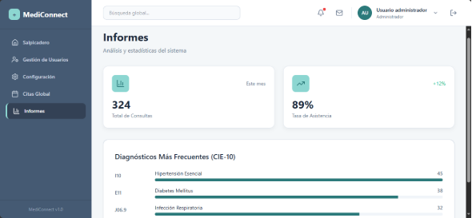

**Épica 6: Administración y Configuración del Sistema**

**HU-10: Gestión de Plantillas Clínicas Flexibles**

**Como** Administrador del sistema,
**Quiero** crear, listar, editar y gestionar el estado de plantillas médicas de texto plano,
**Para** estandarizar las estructuras de evolución según la especialidad médica y alimentar el modelo clínico híbrido de las consultas.

**Criterios de Aceptación:**

- Interfaz de Listado (Read): El sistema debe presentar una tabla de datos que liste las plantillas existentes mostrando su Nombre, Descripción y Estado actual (Activo/Inactivo).

- Formulario de Creación (Create): El administrador debe poder registrar nuevas plantillas definiendo obligatoriamente el Nombre y la Estructura Base (cuerpo del texto).

- Regla de Sanitización (Seguridad): El campo de Estructura Base debe procesar correctamente los saltos de línea (\n), pero el sistema (tanto en el frontend como en el backend) debe sanitizar la entrada y rechazar estrictamente cualquier etiqueta HTML o script (prevención de vulnerabilidades XSS).

- Desactivación Lógica (Soft-Delete): Para evitar inconsistencias con la base de datos, las plantillas no tendrán opción de eliminación física. Solo podrán ser pasadas a estado "Inactivo", lo cual evitará que aparezcan en los selectores de los médicos durante una nueva consulta.

- Control de Acceso (RBAC): El endpoint de la API y la ruta del frontend asociados a esta funcionalidad deben estar bloqueados y ser accesibles única y exclusivamente por usuarios autenticados que posean el rol ADMIN.

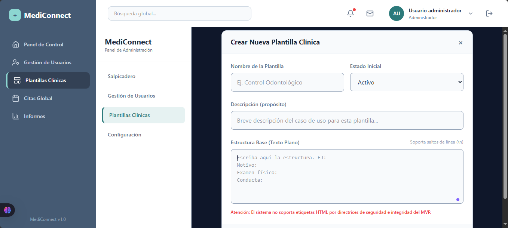

**Diagrama Relacional**

A continuación se presenta el Diagrama Entidad-Relación (ER) que modela las principales entidades del sistema y sus relaciones. Este diagrama ilustra entidades clave como users, patients, medical_records, doctors, consultations, clinical_templates, system_settings, y notifications.

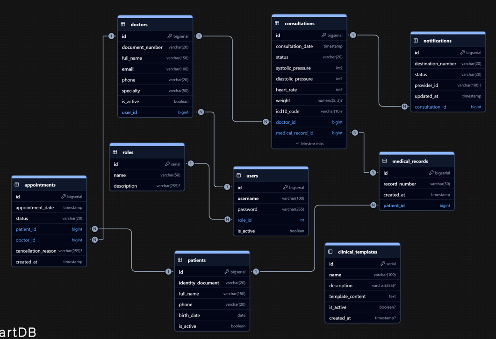

**Diagramas de Flujo de la Aplicación**

Los diagramas de flujo muestran los procesos críticos: el flujo de agendamiento desde recepción hasta confirmación, el envío asíncrono de notificaciones mediante n8n, y el flujo de atención médica durante la consulta. Cada diagrama destaca las decisiones, transacciones After-Commit y puntos de integración externa que requieren pruebas e instrumentación.

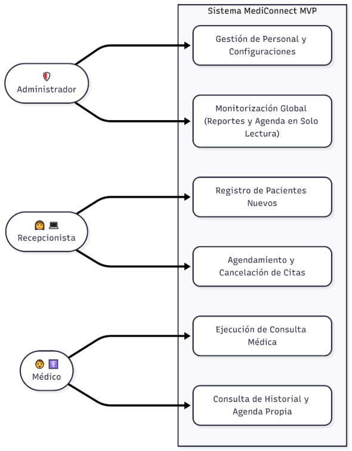

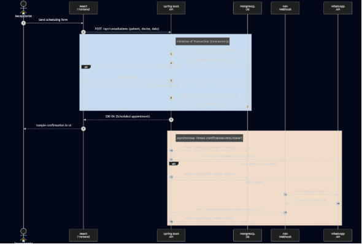

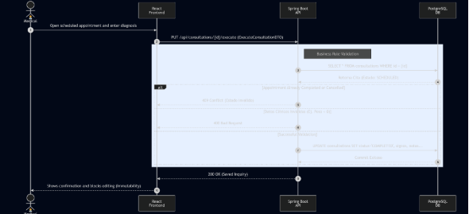

Contratos de API (Especificación de Integración)

Para garantizar el desacoplamiento entre el frontend (React) y el backend (Spring Boot), el sistema operará bajo una arquitectura RESTful estricta. A continuación se documenta el contrato del endpoint más crítico del sistema (Agendamiento), el cual servirá como estándar para el resto de la API.

Endpoint: POST /api/consultations

Propósito: Registrar una nueva cita médica ejecutando validación de concurrencia.

Protección: Requiere Header Authorization: Bearer <JWT> (Rol: RECEPCIONISTA).

Payload de Petición (Request JSON):

JSON

```json
{
  "medicalRecordId": 105,
  "doctorId": 12,
  "consultationDate": "2026-06-15T14:30:00Z"
}
```

Respuestas Esperadas (Responses):

- 201 Created: La cita fue agendada exitosamente. Retorna el ID de la cita generada.
- 400 Bad Request: Estructura JSON inválida o fecha en el pasado.
- 409 Conflict: Violación de regla de negocio. El médico ya tiene una cita asignada en ese bloque de 30 minutos (Solapamiento).
- 403 Forbidden: El token JWT es válido, pero el usuario no tiene el rol de RECEPCIONISTA.

**Requisitos No Funcionales (RNF) y Seguridad**

Dado que MediConnect procesará información clínica protegida, el sistema debe adherirse a restricciones técnicas rigurosas que no son negociables.

Seguridad y Control de Acceso:

1. Encriptación de Credenciales: Todas las contraseñas en la tabla users serán procesadas por el algoritmo Argon2id (estándar OWASP actual). Prohibido el uso de MD5 o SHA-256 sin *salt*.
1. Ciclo de Vida del Token (TTL): El token JWT tendrá un tiempo de expiración estricto de 2 horas. No se implementará *Refresh Token*. Por seguridad clínica, si un médico deja la sesión abierta, el sistema debe forzar un nuevo login para evitar accesos no autorizados al consultorio.
1. CORS (Cross-Origin Resource Sharing): El backend de Spring Boot estará configurado para aceptar peticiones HTTP única y exclusivamente desde el dominio/IP exacto donde esté desplegado el frontend de React.

Rendimiento y Disponibilidad:

1. Tiempo de Respuesta (Latencia): Las transacciones de lectura (GET) deben responder en menos de 300ms. Las transacciones de escritura compleja (como agendamiento con bloqueo en base de datos) no deben superar los 800ms.
1. Bloqueos de Base de Datos: Las consultas de disponibilidad de agenda utilizarán bloqueos pesimistas (PESSIMISTIC\_WRITE) limitados estrictamente al nivel de fila para no congelar la tabla completa de consultations.

**Arquitectura de Despliegue (Infraestructura Single-Tenant)**

El sistema está diseñado bajo un modelo *Single-Tenant* (una instancia de infraestructura por clínica) para garantizar el aislamiento físico de los datos médicos.

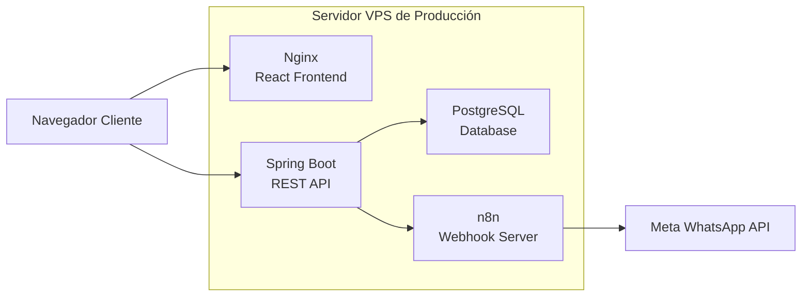

*(Nota sobre la gráfica: Muestra explícitamente que el navegador del cliente descarga el frontend desde Nginx, pero se comunica directamente con la API de Spring Boot. Spring Boot orquesta la base de datos y dispara los eventos hacia el contenedor local de n8n, el cual es el único con salida hacia Meta).*

**Matriz de Riesgos Técnicos (Contingencia)**

El diseño asume que los componentes fallarán. Esta matriz define la tolerancia a fallos del sistema y las rutas de mitigación.

|Componente Crítico|Riesgo Identificado|Impacto Operativo|Estrategia de Mitigación (Fallback)|
| :- | :- | :- | :- |
|Base de Datos (PostgreSQL)|Corrupción de datos o caída del servidor.|CRÍTICO. Pérdida total de historias clínicas y agenda.|Automatización de rutinas pg\_dump a las 02:00 AM. Los volcados encriptados se enviarán fuera del servidor a un espacio de almacenamiento en la nube de alta capacidad (ej. TeraBox / AWS S3) garantizando un RTO (Tiempo de recuperación) menor a 4 horas.|
|Integración n8n / Meta|Caída de la API de Meta o error en el webhook local de n8n.|MODERADO. Los pacientes no reciben confirmación por WhatsApp.|Desacoplamiento asíncrono. La caída de n8n no congela el agendamiento. El backend marca el registro en la tabla notifications como FAILED. La recepcionista revisa el panel de alertas y llama al paciente manualmente.|
|Red (Latencia)|Conexión a internet inestable en la clínica.|MODERADO. Errores de *timeout* al intentar guardar la evolución médica.|El frontend en React implementará un botón de reintento en las peticiones que fallen por error de red (ERR\_NETWORK), manteniendo el *payload* en el estado (state) para que el médico no pierda lo que escribió.|


## Cronograma Detallado (6 Meses - Entregas Mensuales)

- Mes 1 (Entrega 1): Análisis, Arquitectura y Base de Datos.
Artefactos: Documento de Arquitectura (SAD), Casos de Uso, Modelo Relacional, script V1__init_schema_mediconnect.sql y Prototipos UI en Figma. (Fase actual completada).

- Mes 2 (Entrega 2): Backend - Seguridad y Entidades Base (Spring Boot).
Entregables: Configuración de Spring Security con JWT y encriptación Argon2id. Endpoints CRUD para Usuarios (RBAC estricto), Doctores y Pacientes.

- Mes 3 (Entrega 3): Backend - Motor Transaccional y Automatización.
Entregables: Lógica de agendamiento con manejo de concurrencia (PESSIMISTIC_WRITE), endpoints para ejecución de consultas clínicas (inmutabilidad). Programación del hilo asíncrono y configuración del flujo receptor en n8n.

- Mes 4 (Entrega 4): Frontend - Estructura y Seguridad (React).
Entregables: Inicialización con Vite, enrutamiento protegido (React Router), Contexto de Autenticación para el token JWT, renderizado dinámico del Layout (Sidebar según roles) y maquetación de vistas CRUD.

- Mes 5 (Entrega 5): Frontend - Integración Transaccional.
Entregables: Conexión asíncrona (Axios/Fetch) con la API para el módulo complejo de agendamiento, validación de formularios de evolución clínica, y mapeo de errores HTTP (renderizar correctamente el 409 Conflict o 400 Bad Request en la UI).

- Mes 6 (Entrega 6): QA, Pruebas de Integración y Preparación de Despliegue.
Entregables: Ejecución de pruebas unitarias y de integración (JUnit/Testcontainers), corrección de fallos de interfaz, separación de variables de entorno para infraestructura y empaquetado final del software (el archivo .jar del backend y el directorio build estático del frontend).

## Plan de Pruebas (Detalle)

- Unit Tests: JUnit + Mockito para servicios y lógica de negocio. Cobertura objetivo mínima 65% en servicios críticos.
- Integration Tests: Spring Boot Test con base de datos en memoria (Testcontainers/Postgres). Escenarios: agendamiento concurrente, creación de paciente con medical record, endpoints de notificación.
- Pruebas de Concurrencia: Simular N usuarios intentando reservar el mismo bloque; validar que solo 1 transacción persiste y las demás reciben 409.


