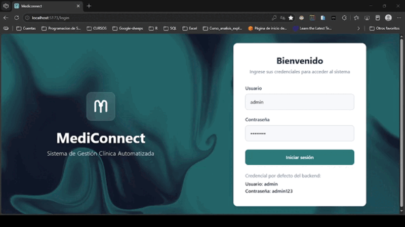
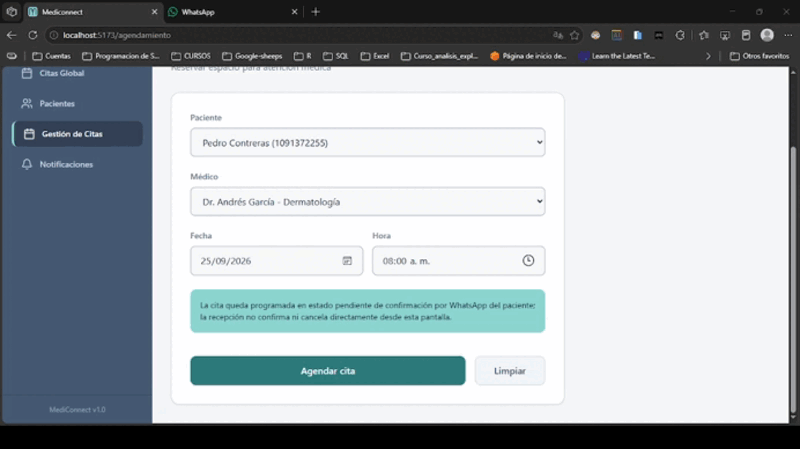
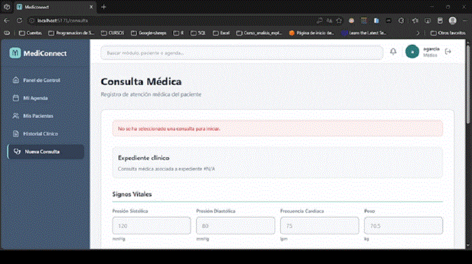
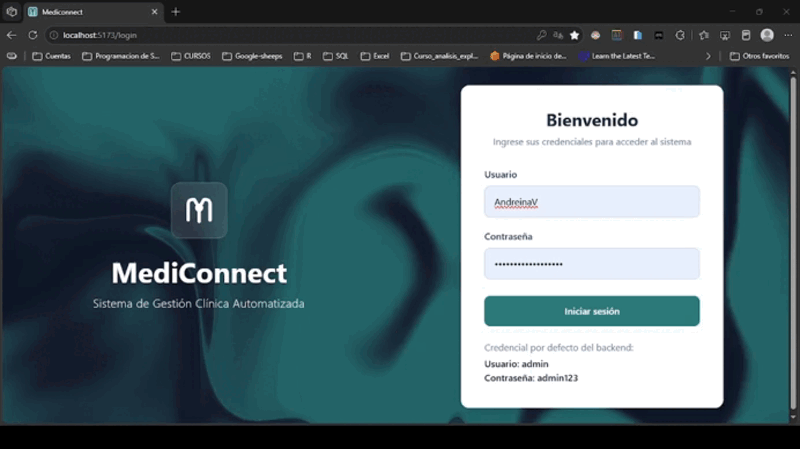

# MediConnect

MediConnect es una plataforma web para la gestión de clínicas médicas. Permite administrar pacientes, usuarios, recepcionistas, citas, consultas clínicas, plantillas, reportes y mensajes de WhatsApp mediante una API protegida con JWT y una interfaz React adaptada por rol.

## 🖼️ Vista previa

| Panel de administrador | Agendamiento de cita clínica |
| --- | --- |
|  |  |

| Registro de consulta clínica | Notificaciones de WhatsApp |
| --- | --- |
|  |  |


## 👥 Roles

| Rol | Funciones principales |
| --- | --- |
| Administrador | Usuarios, recepcionistas, plantillas clínicas, citas globales, reportes y métricas estratégicas |
| Médico | Dashboard clínico, agenda propia, pacientes relacionados, historial y ejecución de consultas |
| Recepcionista | Registro y gestión de pacientes, agendamiento, citas globales, cancelaciones, mensajes y métricas operativas |

## 🛠️ Tecnologías

### Backend

- Java 17
- Spring Boot 3.1.6
- Spring Web
- Spring Data JPA
- Spring Security
- JWT (`jjwt`)
- Flyway
- PostgreSQL
- Bean Validation
- Springdoc OpenAPI / Swagger
- Maven

### Frontend

- React 18
- TypeScript
- Vite
- React Router
- Tailwind CSS
- Axios
- Lucide React
- Recharts

## 🤖 Integración con WhatsApp y n8n

La confirmación, cancelación y recordatorio de citas se automatiza mediante n8n, que actúa como orquestador entre el backend y WhatsApp (vía Evolution API, self-hosted). El flujo se compone de tres workflows:

- **Confirmación saliente:** al agendar una cita, el backend llama a un webhook de n8n que envía al paciente un mensaje de WhatsApp con los detalles de la cita y las instrucciones para confirmarla o cancelarla.
- **Recordatorio saliente:** un proceso programado (cron) en el backend dispara un segundo webhook 24 horas antes de la cita, enviando un recordatorio con la misma lógica de confirmación.
- **Router entrante:** un webhook escucha los mensajes entrantes de WhatsApp. Al recibir comandos de texto libre como `CONFIRMAR {id}` o `CANCELAR {id}`, identifica la acción solicitada y actualiza el estado de la cita correspondiente mediante la API del backend.

Las URLs, claves y nombres de instancia (tanto de n8n como de Evolution API) deben configurarse mediante variables de entorno y no deben escribirse en el repositorio.

## 📁 Estructura del proyecto

```text
MediConnect/
├── backend/
│   ├── pom.xml
│   └── src/main/
│       ├── java/com/sena/backend/
│       │   ├── controller/       # Endpoints REST
│       │   ├── domain/           # Entidades, DTOs y enums
│       │   ├── repository/       # Persistencia JPA
│       │   ├── security/         # JWT y autorización
│       │   ├── service/          # Lógica de negocio
│       │   └── exception/        # Manejo de errores
│       └── resources/
│           ├── application.yml
│           └── migration/         # Migraciones Flyway
│
├── frontend/
│   ├── package.json
│   └── src/
│       ├── app/
│       │   ├── components/       # Layout, sidebar y componentes UI
│       │   ├── context/          # Contexto de autenticación
│       │   ├── screens/          # Pantallas por módulo y rol
│       │   └── types/            # Tipos TypeScript
│       └── service/              # Cliente Axios y API
│
└── README.md
```

## Requisitos

- JDK 17
- Maven 3.8 o superior
- Node.js 18 o superior
- npm o pnpm
- PostgreSQL compatible con el esquema del proyecto

## ⚙️ Configuración del backend

La configuración se encuentra en `backend/src/main/resources/application.yml`. Para evitar credenciales en el código, usa variables de entorno:

```text
DB_URL=jdbc:postgresql://localhost:5432/mediconnect
DATABASE_USERNAME_P=postgres
DB_PASSWORD_P=12345
JWT_SECRET=una_clave_segura
JWT_EXP_MINUTES=180
ADMIN_SETUP_PASSWORD=admin123
N8N_API_KEY=tu_api_key
N8N_WEBHOOK_URL=tu_webhook
N8N_WEBHOOK_REMINDER_URL=tu_webhook_de_recordatorio
EVOLUTION_API_URL=tu_url
EVOLUTION_API_KEY=tu_api_key
EVOLUTION_INSTANCE_NAME=tu_instancia
```
El sistema inicializa un usuario administrador por defecto (admin / valor de ADMIN_SETUP_PASSWORD) si la tabla de usuarios está vacía.

El backend utiliza PostgreSQL y Flyway. No elimines Flyway ni cambies el esquema de la base de datos sin actualizar las migraciones correspondientes.

Flyway gestiona el 100% del esquema de base de datos: al levantar la aplicación por primera vez contra una base de datos vacía, ejecuta automáticamente todas las migraciones (`backend/src/main/resources/migration/V1__init.sql` en adelante) en orden, sin necesidad de un script `schema.sql` independiente. No elimines Flyway ni cambies el esquema de la base de datos sin agregar una nueva migración versionada.

## ▶️ Ejecutar el backend

Desde la raíz del repositorio:

```bash
cd backend
mvnw spring-boot:run
```

La API queda disponible en:

```text
http://localhost:8080
```

Documentación OpenAPI:

```text
http://localhost:8080/swagger-ui.html
http://localhost:8080/v3/api-docs
```

## 💻 Configuración y ejecución del frontend

La URL base de la API se configura mediante `VITE_API_URL`. En desarrollo, crea `frontend/.env`:

```env
VITE_API_URL=http://localhost:8080
```

Instala dependencias y ejecuta Vite:

```bash
cd frontend
npm install
npm run dev
```

La interfaz queda disponible normalmente en:

```text
http://localhost:5173
```

Para generar el build de producción:

```bash
npm run build
```

## 🔐 Autenticación y autorización

El login se realiza con:

```http
POST /api/auth/login
Content-Type: application/json
```

```json
{
  "username": "usuario",
  "password": "contraseña"
}
```

La API devuelve un token JWT. El frontend lo guarda para mantener la sesión y lo envía en cada petición protegida mediante el header:

```http
Authorization: Bearer <token>
```

El rol del usuario se obtiene del token y controla las rutas y opciones visibles del frontend. Las rutas protegidas redirigen a `/login` cuando no existe una sesión válida y al dashboard correspondiente cuando el rol no tiene permiso.

## 🧭 Rutas principales del frontend

| Ruta | Acceso |
| --- | --- |
| `/login` | Todos |
| `/dashboard` | Dashboard según rol |
| `/pacientes` | Recepcionista y médico según flujo autorizado |
| `/usuarios` | Administrador |
| `/recepcionistas` | Administrador |
| `/plantillas` | Administrador |
| `/citas-global` | Administrador y recepcionista |
| `/reportes` | Administrador |
| `/agendamiento` | Recepcionista |
| `/notificaciones` | Recepcionista |
| `/mi-agenda` | Médico |
| `/historial` | Médico |
| `/consulta` | Médico |

## 🔌 Endpoints principales

### Autenticación

- `POST /api/auth/login`

### Pacientes

- `GET /api/patients`
- `GET /api/patients/{id}`
- `POST /api/patients`
- `PUT /api/patients/{id}`
- `DELETE /api/patients/{id}`

### Usuarios y recepcionistas

- `GET /api/users/doctors`
- `GET /api/users/doctors/{id}`
- `POST /api/users/doctors`
- `PUT /api/users/doctors/{id}`
- `DELETE /api/users/doctors/{id}`
- `POST /api/users/receptionists`
- `GET /api/receptionists`
- `GET /api/receptionists/{id}`
- `PUT /api/receptionists/{id}`
- `DELETE /api/receptionists/{id}`
- `POST /api/users/assign-role`

### Citas

- `POST /api/appointments/book`
- `GET /api/appointments`
- `GET /api/appointments/{id}`
- `GET /api/appointments/patient/{patientId}`
- `GET /api/appointments/doctor/{doctorId}`
- `GET /api/appointments/pending-confirmation`
- `PATCH /api/appointments/{id}/confirm`
- `PATCH /api/appointments/{id}/cancel`

Las respuestas de listados pueden ser paginadas. El frontend debe utilizar los metadatos de `Page`, como `content`, `totalElements`, `totalPages` y `number`, en lugar de asumir que la cantidad de elementos visibles es el total de la base de datos.

### Consultas clínicas

- `GET /api/consultations`
- `GET /api/consultations/{id}`
- `GET /api/consultations/patients`
- `GET /api/consultations/patient-timeline/{medicalRecordId}`
- `PUT /api/consultations/{id}/execute`

### Plantillas y reportes

- `GET /api/templates`
- `GET /api/templates/active`
- `POST /api/templates`
- `PUT /api/templates/{id}`
- `PATCH /api/templates/{id}/activate`
- `PATCH /api/templates/{id}/deactivate`
- `GET /api/reports/dashboard`

### WhatsApp e integraciones

- `GET /api/whatsapp/messages/unread`
- `PATCH /api/whatsapp/messages/{id}/read`
- `POST /api/integrations/whatsapp/messages`
- `PATCH /api/integrations/appointments/{id}/confirm`
- `PATCH /api/integrations/appointments/{id}/cancel`
- `GET /api/integrations/patients/lookup`
- `POST /api/integrations/notifications/status`

## 📋 Estados de las citas

Los estados se mantienen en inglés en el contrato de la API y se traducen únicamente en la interfaz:

| Estado API | Texto mostrado |
| --- | --- |
| `SCHEDULED` | Programada |
| `CANCELED` | Cancelada |
| `PENDING_CONFIRMATION` | Pendiente de Confirmación |
| `COMPLETED` | Completada |

## Desarrollo y validación

Antes de abrir un cambio:

```bash
# Frontend
cd frontend
npm run build

# Backend
cd ../backend
mvn test
```

Si se usa PostgreSQL local, verifica que el backend pueda conectarse antes de iniciar el frontend. No ejecutes una segunda instancia del backend si el puerto `8080` ya está ocupado.

## 🛡️ Seguridad

- No subas contraseñas, JWT, claves de n8n ni claves de Evolution API.
- Usa un `JWT_SECRET` fuerte en entornos distintos de desarrollo.
- Configura CORS y credenciales según el dominio de despliegue.
- Mantén las restricciones de rol tanto en el backend como en el frontend. El frontend no sustituye la autorización del backend.

## 🎓 Contexto académico

MediConnect fue desarrollado como proyecto de grado para el Técnico en Programación de Software del SENA (Servicio Nacional de Aprendizaje), cumpliendo con los estándares y competencias exigidos por el programa. El proyecto integra buenas prácticas de arquitectura backend, diseño de interfaces por rol y automatización de procesos mediante servicios externos (n8n, Evolution API), como evidencia de las competencias adquiridas durante la formación.

## Licencia

Este proyecto no declara actualmente una licencia de distribución en el repositorio. Define una licencia antes de publicar el código fuera del equipo.
